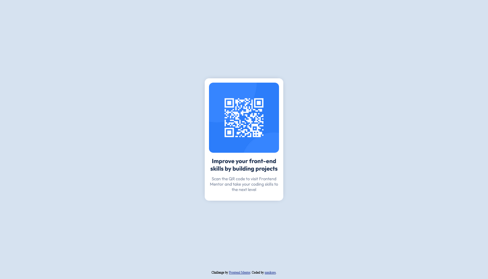

# Frontend Mentor - QR code component solution

This is a solution to the [QR code component challenge on Frontend Mentor](https://www.frontendmentor.io/challenges/qr-code-component-iux_sIO_H). Frontend Mentor challenges help you improve your coding skills by building realistic projects. 

## Table of contents

- [Overview](#overview)
  - [Screenshot](#screenshot)
  - [Links](#links)
- [My process](#my-process)
  - [Built with](#built-with)
  - [What I learned](#what-i-learned)
  - [Useful resources](#useful-resources)
- [Author](#author)

## Overview
  
### Screenshot

### Links

- Solution URL: [Solution](https://www.frontendmentor.io/solutions/qr-code-challenge-using-css--XNINHPCvt)
- Live Site URL: [Live site URL](https://cdguilherme.github.io/qr-code-challenge/)

## My process

### Built with

- HTML5
- CSS3
- [Outfit font](https://fonts.google.com/specimen/Outfit) - For fonts

### What I learned

With this project I learned a lot about about CSS such as custom fonts, centering div, box shadow and css variables. This project also helped me to reinforce what I've had previously known about the language.

This is also my first project where I've worked with Git and GitHub. This has helped me understand better how these technologies work by utilizing version control.

### Useful resources

- [Center div horizontally and vertically by w3schools](https://www.w3schools.com/howto/howto_css_center-vertical.asp) - This helped me center the card.
- [CSS Box Shadow by w3schools](https://www.w3schools.com/csS/css3_shadows_box.asp) - This helped me understand better how CSS Box Shadow work and how to apply them.
- [Position div at the bottom ofcontainer on stackoverflow](https://stackoverflow.com/questions/526035/how-can-i-position-my-div-at-the-bottom-of-its-container) - This helped me position the attribution message at the bottom of the document.

## Author

- GitHub - [nanikore](https://github.com/nanikore0)
- Frontend Mentor - [@nanikore0](https://www.frontendmentor.io/profile/nanikore0)